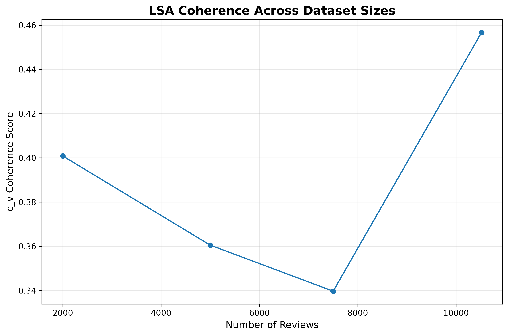
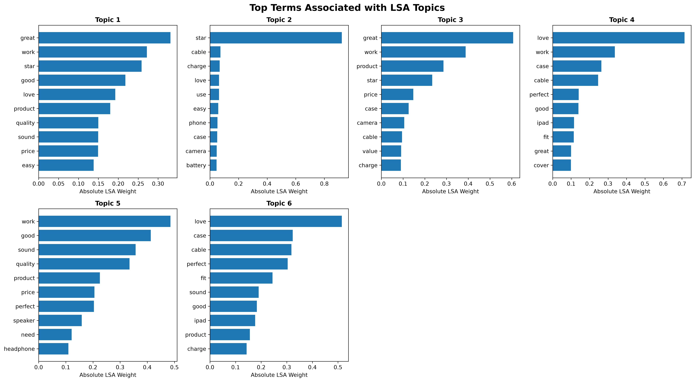
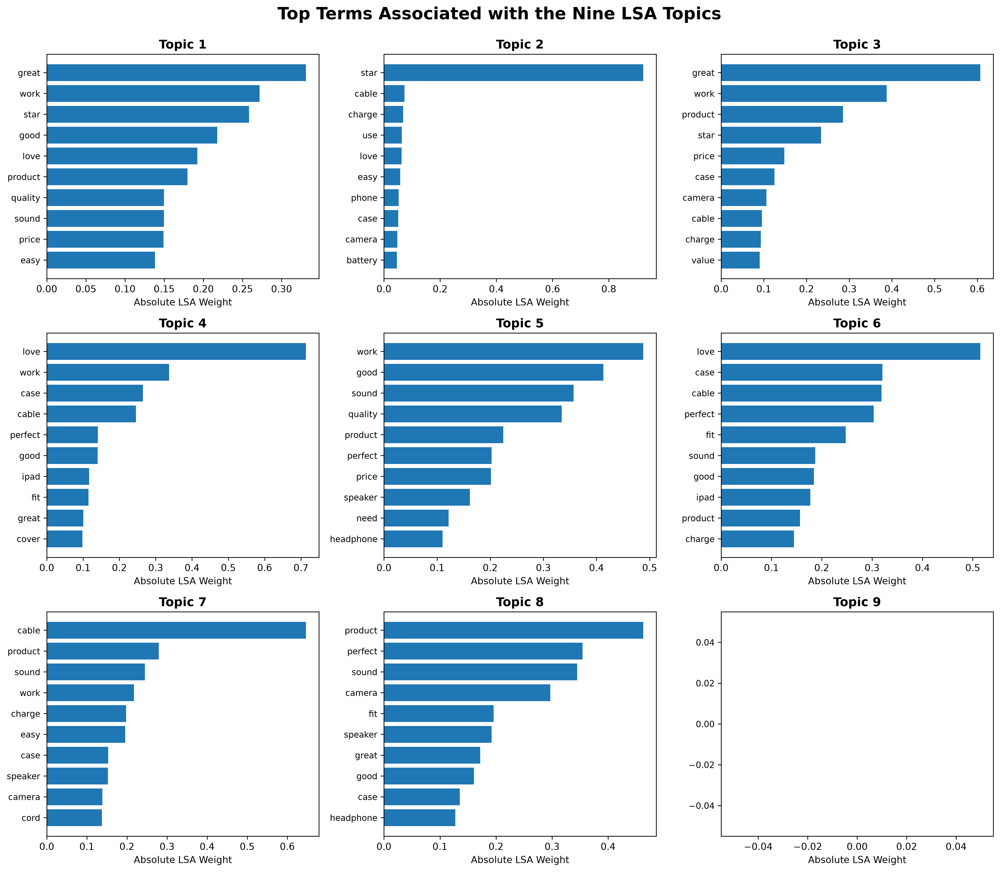
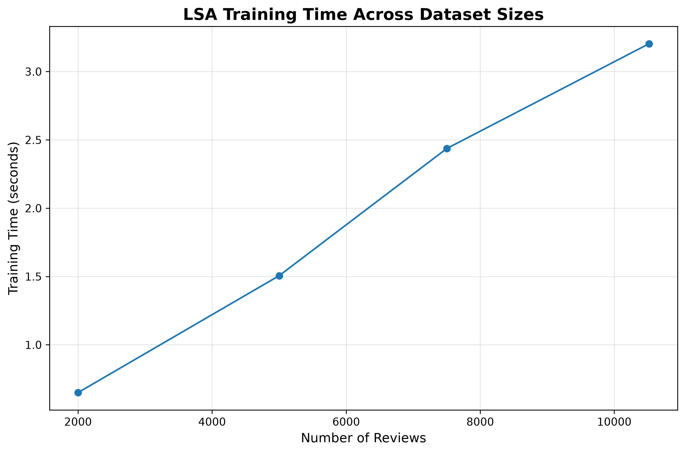

# Automated Aspect Discovery in E-Commerce Reviews


---

## Abstract

This project examines automated aspect discovery in e-commerce customer reviews by comparing traditional statistical topic models with modern transformer-based and graph-based approaches. The objective is to identify which techniques most effectively capture coherent and interpretable product aspects from noisy, user-generated text, thereby supporting downstream tasks such as aspect-based sentiment analysis and data-driven product improvement.

---

## Project Overview

This project investigates automated aspect discovery in e-commerce customer reviews using four topic modeling approaches: classical statistical models, transformer-based methods, and graph-based techniques. The goal is to identify coherent and interpretable product aspects (e.g., quality, delivery, customer service) from noisy user-generated text to support downstream tasks such as aspect-based sentiment analysis and data-driven product improvement.

The repository contains a reproducible pipeline for preprocessing reviews, training topic models, and generating visualizations and metrics that compare their performance and interpretability.

---

## Research Objectives

- **Data preparation**  
  Build a robust preprocessing pipeline for review text, including normalization, tokenization, lemmatization, stopword handling, and domain-specific filtering.

- **Model implementation**  
  Implement and configure four topic modelling approaches:
  - Latent Dirichlet Allocation (LDA)
  - Latent Semantic Analysis (LSA)
  - BERTopic (transformer-based topic modelling)
  - Graph-based topic modelling (co-occurrence / similarity graph with community detection)

- **Evaluation and comparison**  
  - Quantitatively assess topic coherence and diversity.  
  - Qualitatively assess interpretability and semantic consistency of discovered aspects.  
  - Analyze strengths and limitations of each approach in the context of e-commerce reviews.

---
## Data

### Source and Scope

The main dataset consists of e-commerce product reviews stored in a processed CSV file:

- `data/processed/cleaned_reviews_latest.csv`  
  Contains cleaned and preprocessed review text, along with any available metadata (e.g., rating, product category, timestamps).

The original raw data and platform-specific details are not distributed in this repository and should be documented separately in an accompanying academic report or data description.

### Preprocessing Summary

Preprocessing applied to raw reviews includes:

- Text normalization (lowercasing, punctuation and special-character handling).
- Tokenization and lemmatization.
- Stopword removal and optional n-gram/phrase detection.
- Construction of Bag-of-Words or TF–IDF representations for LDA/LSA.
- Generation of dense embeddings for transformer-based modelling (BERTopic).

These steps are implemented in the preprocessing notebook described below.

### Topic Modeling Notebooks

- `notebooks/Latent_Dirichlet_Allocation(LSA).ipynb`  
  Implements Latent Dirichlet Allocation (LDA) using probabilistic topic modeling on Bag-of-Words representations. Despite the filename, this notebook is intended for LDA-based experiments (the acronym “LSA” in parentheses is a naming artifact).

- `notebooks/Latent_Semantic_Analysis.ipynb`  
  Implements Latent Semantic Analysis (LSA) using matrix factorization (typically truncated SVD) on TF–IDF matrices to uncover latent semantic structure in the reviews.

- `notebooks/BERTOPIC_.ipynb`  
  Implements BERTopic, a transformer-based topic modeling framework. This notebook builds document embeddings, performs clustering, and derives topics using class-based TF–IDF. It also produces several interactive visualizations saved under `visualizations/interactive/`.

- `notebooks/Graph_Based.ipynb`  
  Implements a graph-based topic modeling approach, typically by constructing a term co-occurrence or similarity graph and applying community detection or clustering to identify dense subgraphs corresponding to topics or aspects.

Each notebook reports experimental settings, intermediate results, and selected qualitative interpretations, and together they form the methodological backbone of the study.

## Visualizations and Results

Visual outputs are organized in the `visualizations/` directory.

### Interactive Visualizations

Under `visualizations/interactive/`, the following HTML files provide interactive inspection of topic structures:

- `BERTopic_Heatmap.html`  
  Heatmap representation of topic-term or topic-document relationships derived from BERTopic.

- `BERTopic_Hierarchy.html`  
  Hierarchical clustering visualization of BERTopic topics, illustrating topic mergers and relationships.

- `BERTopic_Intertopic_Distance.html`  
  Intertopic distance map showing the relative positions of topics in an embedding space.

- `BERTopic_Top10_Barchart.html`  
  Bar chart visualization of the top terms for selected BERTopic topics.

- `lda_visualization.html`  
  Interactive visualization for LDA topics (e.g., using pyLDAvis or similar tools), enabling exploration of topic-term relationships and topic prevalence.

## Interactive Visualizations

- [BERTopic Intertopic Distance Map](https://htmlpreview.github.io/?https://github.com/FELCIASIJI/automated-aspect-discovery-ecommerce-reviews/blob/feature/readme/visualizations/interactive/BERTopic_Intertopic_Distance.html)
- [BERTopic Hierarchy](https://htmlpreview.github.io/?https://github.com/FELCIASIJI/automated-aspect-discovery-ecommerce-reviews/blob/feature/readme/visualizations/interactive/BERTopic_Hierarchy.html)
- [BERTopic Heatmap](https://htmlpreview.github.io/?https://github.com/FELCIASIJI/automated-aspect-discovery-ecommerce-reviews/blob/feature/readme/visualizations/interactive/BERTopic_Heatmap.html)
- [BERTopic Top-10 Terms Bar Chart](https://htmlpreview.github.io/?https://github.com/FELCIASIJI/automated-aspect-discovery-ecommerce-reviews/blob/feature/readme/visualizations/interactive/BERTopic_Top10_Barchart.html)
- [LDA Topic Visualization](https://htmlpreview.github.io/?https://github.com/FELCIASIJI/automated-aspect-discovery-ecommerce-reviews/blob/feature/readme/visualizations/interactive/lda_visualization.html)

### Static Result Figures

Under `visualizations/results/`, static figures summarize key aspects of the LSA experiments:

- `LSA_Coherence_Scalability.png`  
  Plots topic coherence scores as a function of the number of topics or corpus size, illustrating scalability and quality trade-offs for LSA.
  
  
  

- `LSA_Top_Terms.png`  
  Shows the top terms associated with selected LSA components/topics.
  
  
  

- `LSA_Top_Terms_Nine_Topics.png`  
  Provides a more detailed view of top terms for nine specific LSA topics, facilitating manual interpretation.
  
  
  

- `LSA_Training_Time_Scalability.png`  
  Reports training time as a function of corpus size or number of topics, highlighting computational considerations for LSA.
  
  
  
  
These visualizations are intended to be referenced directly in academic reports, presentations, or technical documentation accompanying the project.

## File and Directory Overview

At the root of the repository:

- `README.md`  
  This documentation file, describing the project aims, data, methods, and outputs.

- `requirements.txt`  
  Lists Python package dependencies required to run the notebooks and reproduce the analysis.

Core directories:

- `data/processed/`  
  Contains `cleaned_reviews_latest.csv`, the preprocessed review dataset used in all modeling notebooks.

- `notebooks/`  
  Contains Jupyter notebooks for preprocessing and each modeling approach (`dataprocessing.ipynb`, `Latent_Dirichlet_Allocation(LSA).ipynb`, `Latent_Semantic_Analysis.ipynb`, `BERTOPIC_.ipynb`, `Graph_Based.ipynb`).

- `visualizations/interactive/`  
  Contains interactive HTML visualizations for BERTopic and LDA.

- `visualizations/results/`  
  Contains static PNG figures summarizing key LSA results.

This organization separates data, analysis notebooks, and results, following common conventions in data science and research-oriented repositories.

## Reproducibility and Usage

### Software Requirements

The analysis environment is based on Python (version 3.8 or later is recommended). All required libraries are specified in `requirements.txt`. To reproduce the experiments:

1. Create a virtual environment (optional but recommended).
2. Install the dependencies listed in `requirements.txt`.
3. Ensure that `data/processed/cleaned_reviews_latest.csv` is present.

### Running the Notebooks

A typical reproduction workflow is:

1. Open `notebooks/dataprocessing.ipynb` to inspect or regenerate the processed dataset if needed.
2. Run the modeling notebooks:
   - `Latent_Dirichlet_Allocation(LSA).ipynb`
   - `Latent_Semantic_Analysis.ipynb`
   - `BERTOPIC_.ipynb`
   - `Graph_Based.ipynb`
3. Inspect the generated outputs in `visualizations/interactive/` and `visualizations/results/`.

All notebooks are designed to be executed sequentially, but each can also be run independently, provided the processed data file is available.

## Limitations and Future Work

- Topic quality and stability depend heavily on dataset characteristics, preprocessing choices, and hyperparameter settings.  
- Transformer-based and graph-based approaches are more computationally demanding than LDA/LSA, which may affect scalability on very large corpora.  
- Current work focuses on aspect discovery; explicit integration with sentiment analysis and business metrics (e.g., sales, returns) is left for future extensions.

Potential future directions:

- Aspect-based sentiment analysis using discovered topics as aspect candidates.  
- Comparative studies across product categories or platforms.  
- Temporal analysis of how aspects and topics evolve over time.  
- Integration with dashboards or web applications for interactive, real-time exploration.

## Academic Use and Citation

If this repository is used in academic work (course projects, dissertations, or publications), the following generic BibTeX entry can be adapted:

```bibtex
@misc{aspect_discovery_ecommerce,
  author       = {Your Name},
  title        = {Automated Aspect Discovery in E-Commerce Reviews},
  year         = {2026},
  howpublished = {\url{https://github.com/<your-username>/<your-repo-name>}},
  note         = {Accessed: YYYY-MM-DD}
}
```

For formal submissions, you may also reference related methodological literature on topic modeling and transformer-based NLP, and include this repository in the reproducibility or supplementary materials section.[web:4][web:18]

---

## Contributing

While the primary focus of this repository is academic experimentation, contributions that improve code structure, add alternative topic modeling techniques, or enhance evaluation and visualization are welcome.

- Fork the repository.
- Create a feature branch: `git checkout -b feature/<feature-name>`.
- Commit changes with clear and descriptive messages.
- Open a pull request explaining the motivation and design of the changes.

---

## Contact

**Author**: *Felcia Sairah Siji*  
**Email**: sijifelcia7@gmail.com  
**Affiliation**: MSc Data Analytics, Technological University of the Shannon: Midlands, Athlone, Ireland.


